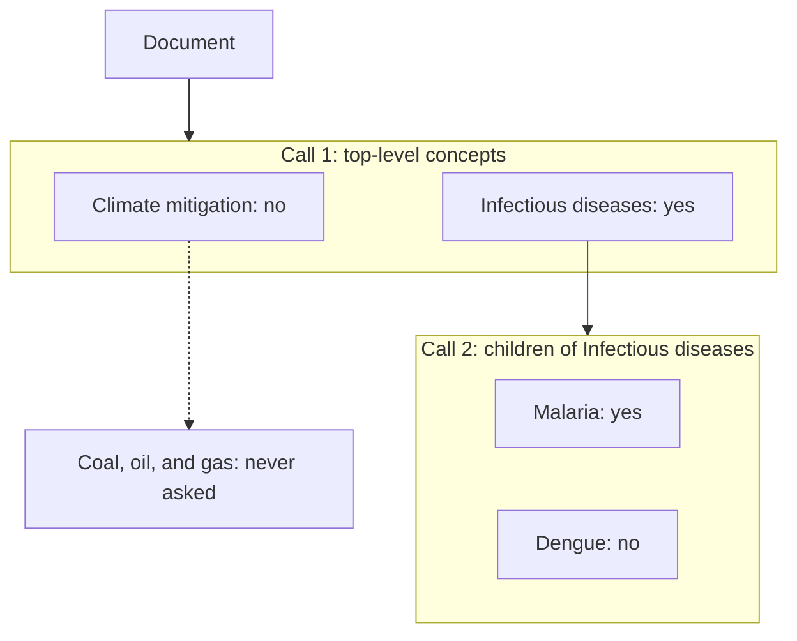

# Extracting concepts defined by vocabularies and taxonomies

A vocabulary is a set of controlled terms or concepts used for categorisation.

A taxonomy is a type of vocabulary where terms or concepts are grouped hierarchically.

Vocabularies and taxonomies can be very useful for organising documents as part of a systematic map.

Deet supports the use of vocabularies and taxonomies to control data extraction behaviour for boolean attributes.
Concretely, they can be used to generate prompts,
and to control how prompts are grouped together.

Deet can read taxonomies in the SKOS format as Turtle (`.ttl`) files. The destiny
[taxonomy builder](https://github.com/destiny-evidence/taxonomy-builder) offers an
interface for building and managing these taxonomies.

## Mapping vocabularies to attributes

To use vocabularies in deet, users must provide a taxonomy, and a file that maps
taxonomy concepts to attributes, as part of data extraction configuration.

CLI users can configure this using the `yaml` file they pass to extraction via
`deet experiments predict --config-path config.yaml` or
`deet experiments evaluate --config-path config.yaml`.
This file can have any valid name, but needs to define the following options:

```yaml
vocabulary_path: <PATH TO YOUR VOCABULARY TTL FILE>
vocabulary_mapping_path: <PATH TO MAPPING FILE>
```

The taxonomy mapping must be a json file made up of
[`ConceptMappingRow`][deet.data_models.taxonomy.ConceptMappingRow]
objects, e.g.

```json
[
  {"attribute_name": "Infectious diseases", "concept_id": "MINT000003"},
  {"attribute_name": "Malaria", "concept_id": "MINT000004"}
]
```

where `concept_id` corresponds to the identifier in the concept's URI.

Any concepts in the vocabulary which do not appear in the mapping are still included for extraction,
but they are not used for evaluation.

## Using vocabularies to generate prompts

Instead of defining prompts by csv, deet can generate prompts from information
in a vocabulary.

To do this, you can run extraction with the `--prompt-population taxonomy` flag,
e.g.

```sh
deet experiments evaluate --config-path config.yaml --prompt-population taxonomy
```

By default, prompt text will come from each concept's `definition` and `scope_note`
fields.
This can be configured by providing a list of fields to the `vocab_prompt_locations`
option in your data extraction config file, e.g.

```yaml
vocabulary_path: <PATH TO YOUR VOCABULARY TTL FILE>
vocabulary_mapping_path: <PATH TO MAPPING FILE>
vocab_prompt_locations:
- alt_labels
- definition
```

Fields are joined with a newline into a single prompt.

## Taxonomy-aware data extraction pipelines

Taxonomies encode useful information about how concepts are related.
This information is ignored when using the default LLM extractor,
which passes the LLM a flat list of all concepts in one single prompt.

The `hierarchical_top_down` method uses the hierarchy instead.
It asks about the top-level concepts first,
and only asks about the children of concepts that the model judged to apply to the document.

```yaml
method: hierarchical_top_down
vocabulary_path: <PATH TO YOUR VOCABULARY TTL FILE>
vocabulary_mapping_path: <PATH TO MAPPING FILE>
```

### Example

Suppose our taxonomy has two top-level concepts, each with children:

- Climate mitigation
  - Coal, oil, and gas
- Infectious diseases
  - Malaria
  - Dengue

and the document is a study of malaria transmission. The extractor works down
the tree one level at a time:



1. The first call asks about the two top-level concepts. The model says
   "Infectious diseases" applies and "Climate mitigation" does not.
2. The second call asks only about the children of "Infectious diseases".
   "Malaria" applies and "Dengue" does not.
3. "Coal, oil, and gas" is never asked about, because its parent did not apply.

A flat extraction would have asked about all five concepts in one call. Here
we ask about four, in two calls. With five concepts that saving is trivial, but
real taxonomies have hundreds of concepts, and each call only needs to consider
a handful of them.

!!! Note "A missed parent hides its children"
    Because a concept is only asked about if its parent applied, a false
    negative high in the tree means nothing below it is ever considered. If
    top-level concepts are broad, write their definitions generously.

If a vocabulary contains several concept schemes, each is descended separately.
